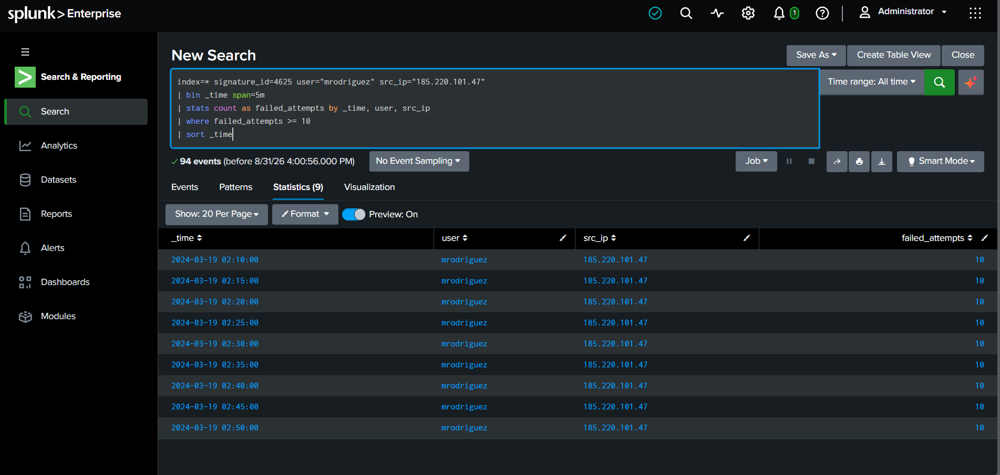
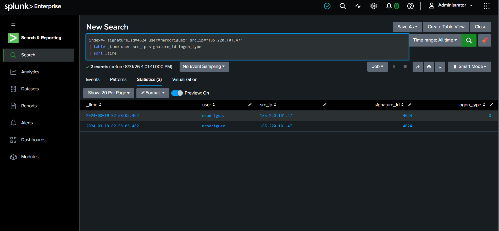
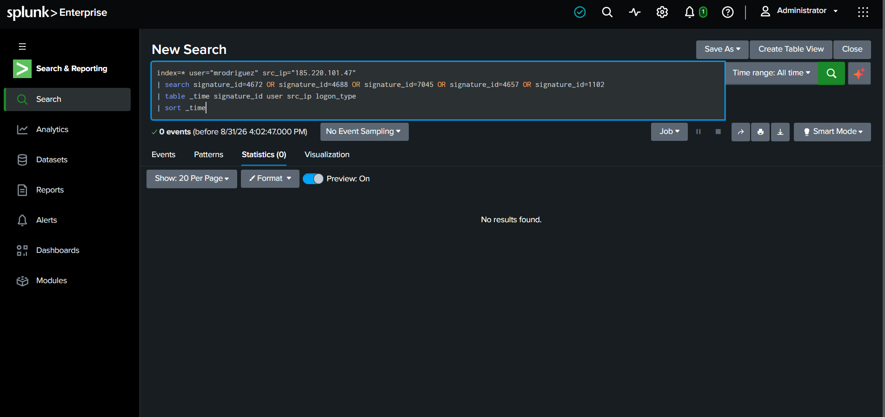
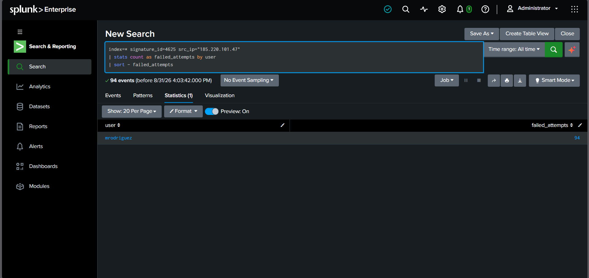

# 🛡️ Windows Brute-Force Detection & Investigation

**SOC L1 Investigation | Splunk | Windows Security Event Logs**

---

## 01. Investigation Overview

### Objective

Detect and investigate suspicious Windows authentication activity by identifying:

- Repeated failed authentication attempts
- Repeated attempts from the same source IP
- Targeted user accounts
- Successful authentication following failed attempts
- Suspicious activity after successful authentication

### Tools Used

- **SIEM:** Splunk Enterprise 10.4.2
- **Log Source:** Windows Security Event Logs
- **Query Language:** SPL
- **Investigation Level:** SOC L1

---

## 02. Investigation Summary

| Attribute | Finding |
|---|---|
| **User** | `mrodriguez` |
| **Source IP** | `185.220.101.47` |
| **Failed Attempts** | **94** |
| **Successful Authentication** | **Observed** |
| **Successful Event** | `4624` |
| **Logon Type** | `3 — Network` |
| **Assessment** | **Potential Account Compromise** |

> **⚠️ Priority:** High  
> Repeated failed authentication attempts were followed by successful authentication from the same source IP.

---

## 03. Windows Event IDs

| Event ID | Description | Investigation Purpose |
|:---:|---|---|
| `4624` | Successful logon | Identify successful authentication |
| `4625` | Failed logon | Detect brute-force activity |
| `4672` | Special privileges assigned | Check for privilege escalation |
| `4688` | New process created | Check for suspicious execution |
| `7045` | New service installed | Check for persistence |
| `4657` | Registry value modified | Check for registry modification |
| `1102` | Audit log cleared | Check for log tampering |

---

## 04. Detection Logic

The detection identifies repeated failed logon attempts from the same source IP against the same user within a five-minute window.

### Detection Threshold

**10 or more failed authentication attempts within a five-minute window.**

### SPL Detection Query

```spl
index=* signature_id=4625
| bin _time span=5m
| stats count as failed_attempts by _time, user, src_ip
| where failed_attempts >= 10
| sort - failed_attempts
```

### Detection Result

The investigation identified:

- **User:** `mrodriguez`
- **Source IP:** `185.220.101.47`
- **Failed authentication events:** `94`

---

## 05. Evidence — Brute-Force Detection

The Splunk search identified repeated failed authentication attempts from the same source IP against the same user.



**Figure 1 — Repeated Windows Event ID 4625 failures detected by Splunk.**

---

## 06. Successful Authentication Correlation

After identifying the failed authentication activity, Event ID `4624` was searched for the same user and source IP.

### Result

A successful authentication was identified:

| Attribute | Value |
|---|---|
| **User** | `mrodriguez` |
| **Source IP** | `185.220.101.47` |
| **Event ID** | `4624` |
| **Logon Type** | `3 — Network` |
| **Time** | `02:58:05` |



**Figure 2 — Successful authentication correlated with the same user and source IP.**

> **🔴 Analyst Observation:** A successful network authentication occurred after repeated failed authentication attempts. This significantly increases the priority of the investigation.

---

## 07. Post-Authentication Investigation

The investigation then checked for suspicious activity associated with the same user and source IP.

The following events were reviewed:

- `4672` — Special privileges assigned
- `4688` — New process created
- `7045` — New service installed
- `4657` — Registry value modified
- `1102` — Audit log cleared

### Result

**No matching events were identified** for the investigated user/source combination in the available dataset.



**Figure 3 — No matching post-authentication security events identified.**

---

## 08. Source IP Analysis

The source IP was further investigated to understand the failed authentication activity.

### Findings

| Attribute | Result |
|---|---|
| **Source IP** | `185.220.101.47` |
| **Targeted User** | `mrodriguez` |
| **Failed Attempts** | `94` |
| **Other Users Identified** | No |

The source IP activity was associated with the same user account in the investigated Event ID `4625` data.



**Figure 4 — Source IP and targeted user analysis.**

---

## 09. Analyst Assessment

### Investigation Timeline

```text
Repeated 4625 Failed Logons
          ↓
Same User + Same Source IP
          ↓
94 Failed Authentication Events
          ↓
4624 Successful Authentication
          ↓
Post-Authentication Investigation
          ↓
No Additional Suspicious Events Found
```

### Assessment

The activity is **suspicious** because:

1. A large number of failed authentication attempts were detected.
2. The attempts originated from the same source IP.
3. The activity targeted the same user account.
4. Successful authentication occurred after the failed attempts.
5. No additional suspicious post-authentication events were identified in the available dataset.

### Final Finding

> **Potential brute-force attack with successful authentication.**

The available evidence does not by itself prove that the account was compromised, but the successful authentication following repeated failures warrants further investigation.

---

## 10. Recommended SOC L1 Response

### Immediate Investigation

- [ ] Validate whether `185.220.101.47` is an authorized source.
- [ ] Contact or verify activity with the affected user.
- [ ] Review additional authentication events.
- [ ] Review endpoint activity around the successful login.
- [ ] Check whether the source IP targeted other systems.
- [ ] Escalate to SOC L2 if compromise is suspected.

### Containment

Depending on organizational procedures:

- [ ] Block or investigate the source IP.
- [ ] Reset the affected account credentials if compromise is confirmed.
- [ ] Continue monitoring the affected account.
- [ ] Preserve relevant security logs for further investigation.

---

## 11. Investigation Skills Demonstrated

This project demonstrates practical SOC L1 skills including:

- Windows Security Event Log analysis
- Splunk investigation
- SPL query development
- Event ID analysis
- Brute-force detection
- Authentication correlation
- Source IP investigation
- Timeline analysis
- Post-authentication investigation
- Incident assessment
- SOC L1 escalation and response

---

## 12. Project Structure

```text
brute-force/
│
├── README.md
├── detection.spl
├── investigation.spl
│
└── screenshots/
    ├── 01_bruteforce_detection.png
    ├── 02_successful_authentication.png
    ├── 03_post_authentication.png
    └── 04_source_ip_user_analysis.png
```

---

## 13. Conclusion

This investigation demonstrates how a SOC L1 analyst can identify repeated failed authentication attempts, correlate them with successful authentication, investigate post-authentication activity, and determine the appropriate escalation path.

**Final Assessment:**

**Potential Brute-Force Attack → Successful Authentication → Further Investigation Required**
