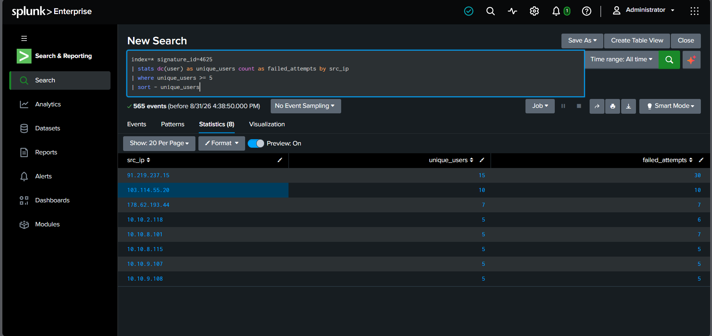
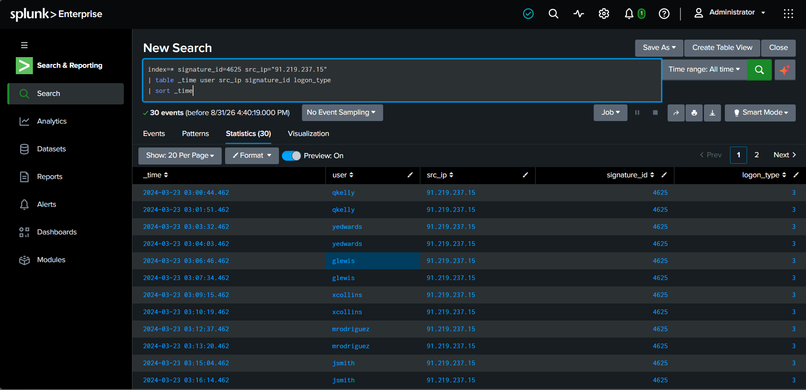
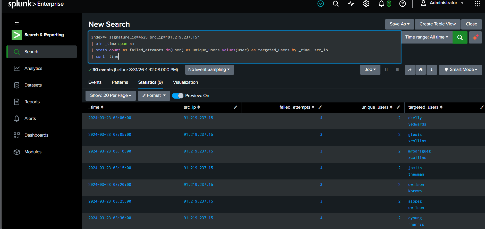
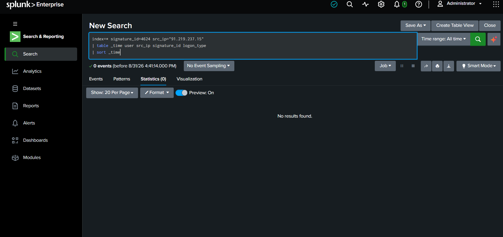
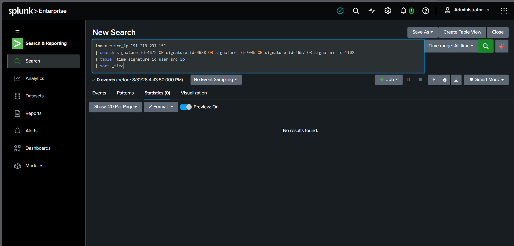

<div align="center">

# 🛡️ Windows Password Spraying Detection & Investigation

### SOC L1 Security Investigation | Splunk Enterprise | Windows Security Logs

<p>
  
  
  
  
</p>

<p>
A practical SOC L1 investigation focused on detecting,
investigating and assessing potential Windows password
spraying activity using Splunk.
</p>

</div>

---

## 📌 Investigation Overview

This project demonstrates a **SOC Level 1 investigation** of
suspected Windows password spraying activity.

The investigation begins with identifying a suspicious source IP
that generated multiple failed authentication attempts against
different user accounts.

The activity was then investigated to determine:

- Which accounts were targeted
- How the authentication attempts occurred over time
- Whether authentication was successful
- Whether suspicious activity followed the authentication attempts
- Whether there was evidence of account compromise

### Investigation Flow

**Detection → Source IP Analysis → Targeted Users → Timeline Analysis → Successful Authentication Check → Post-Authentication Review → Final Assessment**

---

## 🎯 Investigation Objectives

The primary objectives were to identify:

- Multiple failed Windows authentication attempts
- A single source IP targeting multiple user accounts
- Repeated authentication attempts over time
- Any successful authentication from the suspicious source
- Suspicious activity following authentication
- Potential indicators of account compromise

---

## 🧰 Tools & Technologies

| Technology | Purpose |
|---|---|
| **Splunk Enterprise** | SIEM platform used for detection and investigation |
| **Windows Security Logs** | Authentication and security telemetry |
| **SPL** | Detection, filtering and event correlation |
| **Windows Event IDs** | Authentication and post-authentication analysis |

---

## 🪪 Relevant Windows Event IDs

| Event ID | Description | Investigation Purpose |
|:---:|---|---|
| `4625` | Failed logon | Identify failed authentication activity |
| `4624` | Successful logon | Determine whether authentication succeeded |
| `4672` | Special privileges assigned | Identify privileged activity |
| `4688` | New process created | Identify possible process execution |
| `7045` | New service installed | Identify possible persistence |
| `4657` | Registry value modified | Identify registry modifications |
| `1102` | Audit log cleared | Identify possible log tampering |

---

# 🔍 Detection

## Detection Logic

Password spraying differs from traditional brute-force activity.

In a password spraying attack, an attacker typically attempts
authentication against **multiple user accounts** rather than
repeatedly attacking a single account.

For this investigation, a source IP targeting **5 or more unique
user accounts** was considered a potential password spraying
candidate.

### Detection Pattern

**One Source IP → Multiple Users → Multiple Failed Logons**

### Detection Result

| Indicator | Finding |
|---|---|
| **Suspicious Source IP** | `91.219.237.15` |
| **Unique Users Targeted** | **15** |
| **Failed Authentication Attempts** | **30** |
| **Detection Threshold** | **5+ unique users** |
| **Initial Assessment** | **Potential Password Spraying** |

## MITRE ATT&CK Mapping

| Technique ID | Technique Name | Why It Applies |
|---|---|---|
| T1110.003 | Brute Force: Password Spraying | A single source IP attempted authentication against 15 unique accounts rather than repeatedly attacking one — the defining pattern of password spraying |

<p align="center">
  
  <br>
  <sub><b>Figure 1.</b> Splunk detection identifying the suspicious source IP.</sub>
</p>

---

# 🕵️ Investigation

## 1. Source IP Analysis

The suspicious source IP identified during detection was:

### `91.219.237.15`

The source generated failed authentication events against
multiple user accounts.

The investigation identified **15 unique targeted users** and
**30 failed authentication attempts**.

This behavior is consistent with a potential password spraying
pattern because a single source was attempting authentication
against multiple accounts.

---

## 2. Targeted User Analysis

The targeted accounts were reviewed to understand the scope
of the activity.

### Finding

**15 different user accounts were targeted by the same source IP.**

This significantly increases the suspicion compared with a normal
user repeatedly entering an incorrect password on a single account.

<p align="center">
  
  <br>
  <sub><b>Figure 2.</b> Analysis of user accounts targeted by the suspicious source.</sub>
</p>

---

## 3. Attack Timeline Analysis

The failed authentication events were analyzed chronologically
to understand the attack pattern.

The timeline showed repeated authentication failures originating
from the same source IP and targeting different accounts.

### Finding

The activity occurred repeatedly over the investigated period,
providing additional evidence of coordinated authentication
attempts rather than an isolated login failure.

<p align="center">
  
  <br>
  <sub><b>Figure 3.</b> Timeline analysis of the password spraying activity.</sub>
</p>

---

## 4. Successful Authentication Check

After identifying the suspicious source IP, successful Windows
logon activity was reviewed to determine whether the source
successfully authenticated.

### Finding

**No successful authentication was identified from
`91.219.237.15`.**

Based on the available logs, there is no evidence that the
detected password spraying activity resulted in a successful
login.

<p align="center">
  
  <br>
  <sub><b>Figure 4.</b> Splunk investigation showing no successful authentication.</sub>
</p>

---

## 5. Post-Authentication Activity Review

Additional Windows security events were reviewed for the
suspicious source IP.

The investigation included:

| Event ID | Activity Reviewed |
|:---:|---|
| `4672` | Special privileges assigned |
| `4688` | New process creation |
| `7045` | New service installation |
| `4657` | Registry modification |
| `1102` | Audit log clearing |

### Finding

**No relevant suspicious post-authentication activity was
identified for the investigated source IP.**

This provides no additional evidence of successful compromise
within the available telemetry.

<p align="center">
  
  <br>
  <sub><b>Figure 5.</b> Review of additional Windows security activity.</sub>
</p>

---

# 📊 Investigation Summary

| Investigation Area | Result |
|---|---|
| **Suspicious Source IP** | `91.219.237.15` |
| **Unique Users Targeted** | **15** |
| **Failed Authentication Attempts** | **30** |
| **Password Spraying Threshold** | **5+ unique users** |
| **Successful Authentication** | **None identified** |
| **Post-Authentication Suspicious Activity** | **None identified** |
| **Account Compromise Evidence** | **Not identified** |
| **Overall Assessment** | **Potential Password Spraying** |

---

# ⚠️ Final Assessment

The activity was assessed as **potential Windows password spraying**
based on the following observations:

1. A single source IP generated multiple failed authentication events.
2. The source IP targeted **15 unique user accounts**.
3. Authentication failures occurred repeatedly over time.
4. No successful authentication was identified from the suspicious
   source IP.
5. No relevant post-authentication suspicious activity was identified.

### Final SOC L1 Assessment

> **Potential Windows Password Spraying Activity — No Evidence of Successful Account Compromise Identified**

The available logs do not demonstrate a successful compromise.
However, the suspicious source IP and targeted accounts should
continue to be investigated according to organizational procedures.

---

# 🛡️ Recommended SOC L1 Actions

### Investigation

- [ ] Validate whether `91.219.237.15` is an authorized source.
- [ ] Review the targeted accounts for unusual activity.
- [ ] Review authentication events around the attack period.
- [ ] Search for the source IP across other systems and endpoints.
- [ ] Monitor the source IP for additional authentication attempts.

### Escalation

- [ ] Escalate to **SOC L2** if additional suspicious activity is identified.
- [ ] Investigate immediately if successful authentication occurs.
- [ ] Consider blocking the source IP according to organizational policy.
- [ ] Consider credential resets if account compromise is confirmed.

---

# 🧠 SOC L1 Skills Demonstrated

This investigation demonstrates practical experience with:

- **Windows authentication log analysis**
- **Splunk SIEM investigation**
- **SPL-based detection**
- **Password spraying detection**
- **Source IP analysis**
- **User account analysis**
- **Authentication correlation**
- **Timeline analysis**
- **Event ID analysis**
- **Post-authentication investigation**
- **SOC alert triage**
- **Incident assessment and escalation**

---

# 📂 Project Structure

```text
password-spraying/
│
├── README.md
├── detection.spl
├── investigation.spl
│
└── screenshots/
    ├── 01_password_spraying_detection.png
    ├── 02_targeted_users.png
    ├── 03_attack_timeline.png
    ├── 04_no_successful_authentication.png
    └── 05_post_authentication_review.png
