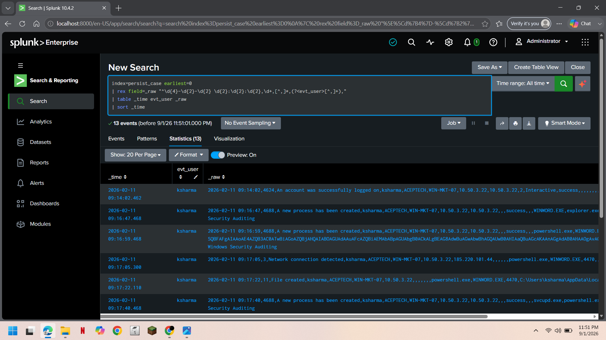
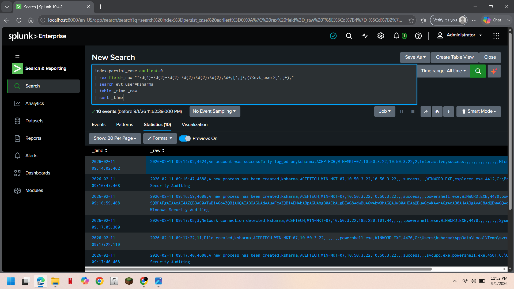
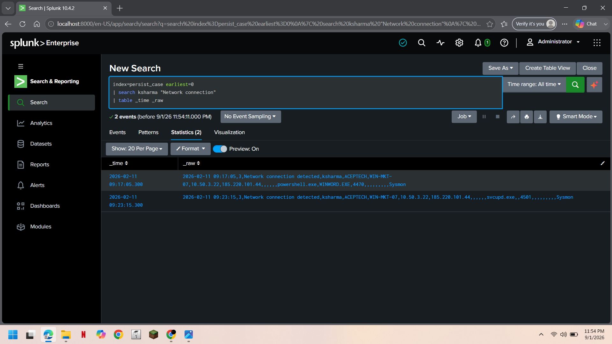
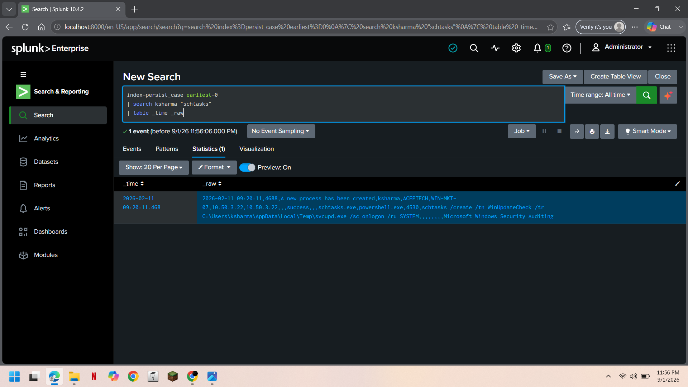

# 🛡️ Windows Persistence Detection & Investigation

**SOC L1 Investigation | Splunk | Windows Security Event Logs + Sysmon**

---

## 01. Investigation Overview

### Objective

Detect and investigate a suspicious process chain originating from a
Microsoft Word document, culminating in registry and scheduled-task
based persistence.

### Tools Used

- **SIEM:** Splunk Enterprise 10.4.2
- **Log Source:** Windows Security Event Logs + Sysmon
- **Query Language:** SPL
- **Investigation Level:** SOC L1

---

## 02. Investigation Summary

| Attribute | Finding |
|---|---|
| **User** | `ksharma` |
| **Host** | `WIN-MKT-07` |
| **Initial Vector** | `WINWORD.EXE` → `powershell.exe` (encoded command) |
| **C2 IP** | `185.220.101.44` |
| **Dropped File** | `svcupd.exe` |
| **Persistence Mechanisms** | Registry Run key + Scheduled Task (`WinUpdateCheck`, runs as SYSTEM) |
| **Assessment** | **Confirmed Malicious Activity — Persistence Established** |

> **⚠️ Priority:** Critical
> A Word document spawned an encoded PowerShell command that
> downloaded and executed a payload, then established two independent
> persistence mechanisms.

---

## 03. Windows Event IDs

| Event ID | Description | Investigation Purpose |
|:---:|---|---|
| `4624` | Successful logon | Establish session baseline |
| `4688` | New process created | Trace the process chain |
| `3` (Sysmon) | Network connection | Identify C2 communication |
| `11` (Sysmon) | File created | Identify dropped payload |
| `13` (Sysmon) | Registry value set | Identify registry persistence |
| `4648` | Explicit credential logon | Identify credential reuse |

---

## 04. Detection Logic

The detection focuses on process ancestry: an Office application
(`WINWORD.EXE`) spawning `powershell.exe` is not normal user behavior
and is a well-known initial-access pattern for macro-based phishing.

### Detection Pattern

**Office Process → PowerShell → Network Connection → File Drop → Persistence**

### SPL Detection Query

```spl
index=persist_case earliest=0
| rex field=_raw "^\d{4}-\d{2}-\d{2} \d{2}:\d{2}:\d{2},\d+,[^,]*,(?<evt_user>[^,]+),"
| search evt_user=ksharma
| table _time _raw
| sort _time
```

### Detection Result

| Indicator | Finding |
|---|---|
| **User** | `ksharma` |
| **Host** | `WIN-MKT-07` |
| **Parent → Child** | `WINWORD.EXE` → `powershell.exe` |
| **Events in Chain** | **10** |
| **Initial Assessment** | Confirmed malicious process chain |

---

## 05. Evidence — Process Chain Detection



**Figure 1 — Full ksharma process chain, sorted by time.**

---

## 06. Parent-Child Process Analysis

`WINWORD.EXE` launched at 09:16:47 (parent: `explorer.exe`), followed
12 seconds later by `powershell.exe` (parent: `WINWORD.EXE`).

### Finding

A Word document spawning PowerShell is not normal user behavior and
is a well-known macro-based initial access pattern.



**Figure 2 — Word document spawning PowerShell.**

---

## 07. Network Connection Analysis

Two outbound connections to `185.220.101.44` were identified,
initiated by `powershell.exe` and later by `svcupd.exe`.

### Finding

| Attribute | Value |
|---|---|
| **Destination IP** | `185.220.101.44` |
| **First Connection** | `09:17:05` (powershell.exe) |
| **Second Connection** | `09:23:15` (svcupd.exe) |

Repeated connections to the same external IP from two different
processes in the chain is consistent with command-and-control
beaconing.



**Figure 3 — Two beacons to the same external IP.**

---

## 08. Dropped File & Registry Persistence

At `09:17:22`, `powershell.exe` created
`C:\Users\ksharma\AppData\Local\Temp\svcupd.exe`. At `09:18:03`,
`svcupd.exe` set a registry Run key:
`HKCU\Software\Microsoft\Windows\CurrentVersion\Run\SvcUpdate`.

### Finding

The dropped binary's name mimics a legitimate "service update"
process, and the registry key ensures it runs at every user logon.


**Figure 4 — Dropped payload and registry Run key persistence.**

---

## 09. Scheduled Task Persistence

At `09:20:11`, `powershell.exe` spawned `schtasks.exe`, creating a
task named `WinUpdateCheck`, configured to run `svcupd.exe` **as
SYSTEM** on every logon.

### Finding

A second, independent persistence mechanism running at SYSTEM
privilege indicates deliberate, hands-on-keyboard activity rather
than a fully automated opportunistic infection.



**Figure 5 — SYSTEM-level scheduled task persistence.**

---

## 10. Analyst Assessment

### Investigation Timeline

```text
WINWORD.EXE opened
       ↓
Encoded PowerShell spawned by Word
       ↓
Outbound connection to 185.220.101.44
       ↓
svcupd.exe dropped to Temp
       ↓
svcupd.exe executed
       ↓
Registry Run key persistence set
       ↓
Scheduled Task "WinUpdateCheck" created (runs as SYSTEM)
       ↓
Explicit credential logon
       ↓
Second beacon to 185.220.101.44
```

### MITRE ATT&CK Mapping

| Technique ID | Technique Name | Why It Applies |
|---|---|---|
| T1566.001 | Phishing: Spearphishing Attachment | Word document is the initial access vector |
| T1059.001 | Command and Scripting Interpreter: PowerShell | PowerShell is the execution vector spawned by Word |
| T1027 | Obfuscated Files or Information | `-enc` conceals the download command |
| T1071.001 | Application Layer Protocol: Web Protocols | Repeated connections to `185.220.101.44` |
| T1547.001 | Registry Run Keys / Startup Folder | `SvcUpdate` Run key persistence |
| T1053.005 | Scheduled Task | `WinUpdateCheck` task runs `svcupd.exe` as SYSTEM |

### Final Finding

> **Confirmed malicious activity — a phishing-delivered encoded
> PowerShell payload established dual, SYSTEM-level persistence.**

---

## 11. Recommended SOC L1 Response

### Immediate Investigation

- [ ] Isolate host `WIN-MKT-07` from the network.
- [ ] Preserve the original Word document for analysis.
- [ ] Confirm whether `svcupd.exe` matches any known malware signature.
- [ ] Validate scope — check if `185.220.101.44` was contacted by other hosts.

### Containment

- [ ] Remove the `SvcUpdate` registry Run key.
- [ ] Delete the `WinUpdateCheck` scheduled task.
- [ ] Quarantine/delete `svcupd.exe` from the Temp directory.
- [ ] Block `185.220.101.44` at the perimeter.
- [ ] Reset `ksharma`'s credentials.

### Escalation

- [ ] Escalate to **SOC L2 / IR** immediately — SYSTEM-level persistence confirmed.
- [ ] Treat as confirmed compromise, not "potential."

---

## 12. SOC L1 Skills Demonstrated

- Windows Security Event Log + Sysmon correlation
- Process ancestry / parent-child chain analysis
- Network (C2) beacon identification
- Persistence mechanism identification (registry + scheduled task)
- MITRE ATT&CK technique mapping
- Full kill-chain timeline reconstruction
- Escalation and containment recommendation

---

## 13. Project Structure

```text
persistence/
│
├── README.md
├── detection.spl
├── investigation.spl
│
└── screenshots/
    ├── 01_process_chain.png
    ├── 02_parent_child_chain.png
    ├── 03_network_connections.png
    ├── 04_dropped_file_and_registry.png
    └── 05_scheduled_task_system.png
```

---

## 14. Conclusion

This investigation traced a full attack chain from initial phishing
delivery through execution, command-and-control, and dual persistence
mechanisms, and produced a MITRE-mapped, SOC L1-level escalation
recommendation.

**Final Assessment:**

**Phishing → Encoded PowerShell → C2 Beacon → Dropped Payload → Dual Persistence (Registry + SYSTEM Scheduled Task) → Confirmed Compromise**
