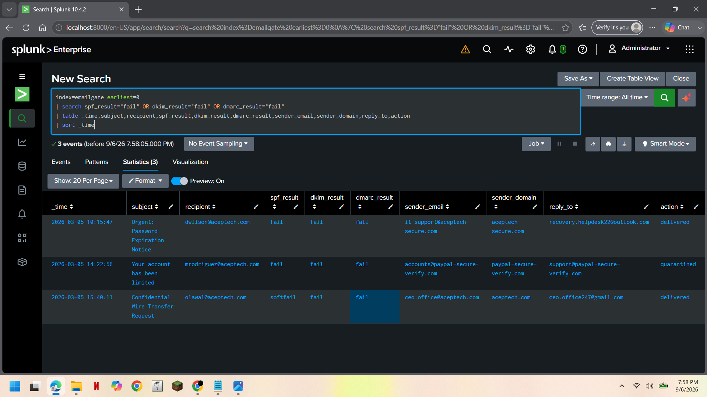
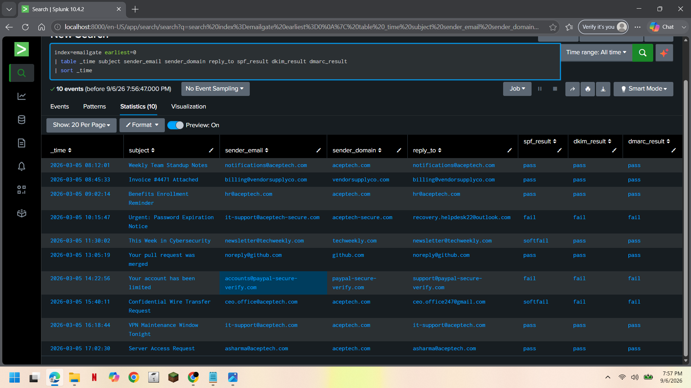
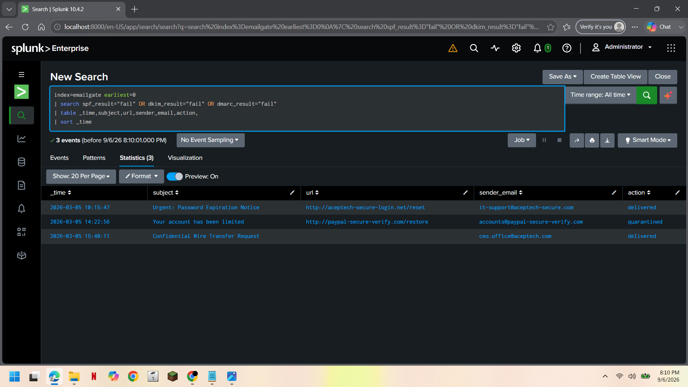

# 🛡️ Phishing Email Detection & Investigation

**SOC L1 Investigation | Splunk | Email Gateway Logs**

---

## 01. Investigation Overview

Detect suspicious inbound emails using failed SPF/DKIM/DMARC checks, lookalike domains, and Reply-To mismatches.

**Tools:** Splunk Enterprise | Email Gateway Logs | SPL

---

## 02. Investigation Summary

| Attribute | Finding |
|---|---|
| **Emails Reviewed** | 10 |
| **Suspicious Emails Found** | 3 |
| **Delivered to Inbox** | 2 of 3 |
| **Auto-Quarantined** | 1 of 3 |
| **Assessment** | Confirmed Phishing — Multiple Techniques |

---

## 03. Detection Query

```spl
index=emailgate earliest=0
| search spf_result="fail" OR dkim_result="fail" OR dmarc_result="fail"
| table _time subject sender_email sender_domain reply_to spf_result dkim_result dmarc_result
| sort _time
```

This filters by **authentication failure**, not known bad senders — so it finds phishing without needing to already know who's suspicious.



**Figure 1 — 3 emails isolated by failed SPF/DKIM/DMARC.**

---

## 04. Cases Found

| # | Sender | Domain | Reply-To | Technique |
|---|---|---|---|---|
| 1 | it-support@aceptech-secure.com | Fake lookalike domain | Random Outlook address | Credential phishing |
| 2 | ceo.office@aceptech.com | Real company domain | Personal Gmail | CEO fraud (BEC) |
| 3 | accounts@paypal-secure-verify.com | Fake PayPal domain | Matches sender | Brand impersonation |

> **Case 2 is the most dangerous** — the sender domain matches the real company exactly. Only the failed DKIM/DMARC and Gmail reply-to expose it.



**Figure 2 — All 10 emails, for comparison against the 3 flagged.**

---

## 05. Malicious Links & Gateway Action

| Sender | URL | Action |
|---|---|---|
| it-support@aceptech-secure.com | `aceptech-secure-login.net/reset` | Delivered |
| accounts@paypal-secure-verify.com | `paypal-secure-verify.com/restore` | Quarantined |
| ceo.office@aceptech.com | *(no link — BEC relies on reply)* | Delivered |

The two most dangerous emails (Case 1 and Case 2) **were both delivered** — the gateway only caught Case 3 automatically.



**Figure 3 — Destination URLs and gateway disposition.**

---

## 06. MITRE ATT&CK Mapping

| Technique ID | Technique Name | Why It Applies |
|---|---|---|
| T1566.001 | Phishing: Spearphishing Link | Case 1's credential-harvesting link |
| T1566.002 | Phishing: Spearphishing Link | Case 3's brand-impersonation link |
| T1656 | Impersonation | Case 2's spoofed CEO identity |

---

## 07. Final Assessment

> **Confirmed phishing across 3 techniques — 2 of 3 bypassed the gateway and reached end users.**

### Recommended Response

- [ ] Block sender domains at the gateway
- [ ] Purge delivered copies of Case 1 and Case 2
- [ ] If Case 1's link was clicked, force password reset
- [ ] Escalate Case 2 (CEO fraud) to SOC L2 / Incident Response immediately

---

## 08. Project Structure

```text
phishing/
│
├── README.md
├── detection.spl
├── investigation.spl
│
└── screenshots/
    ├── 01_email_detection_overview.png
    ├── 02_suspicious_emails_detected.png
    └── 03_malicious_links_and_actions.png
```
