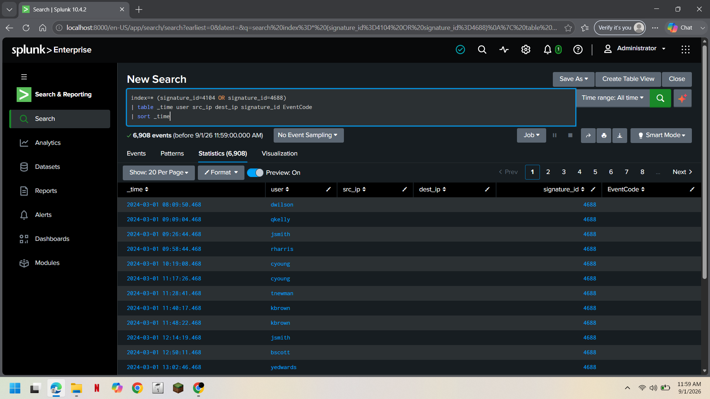
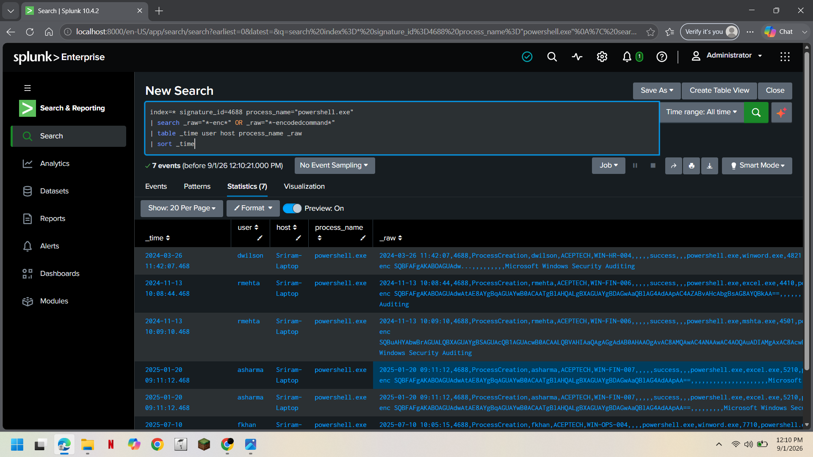
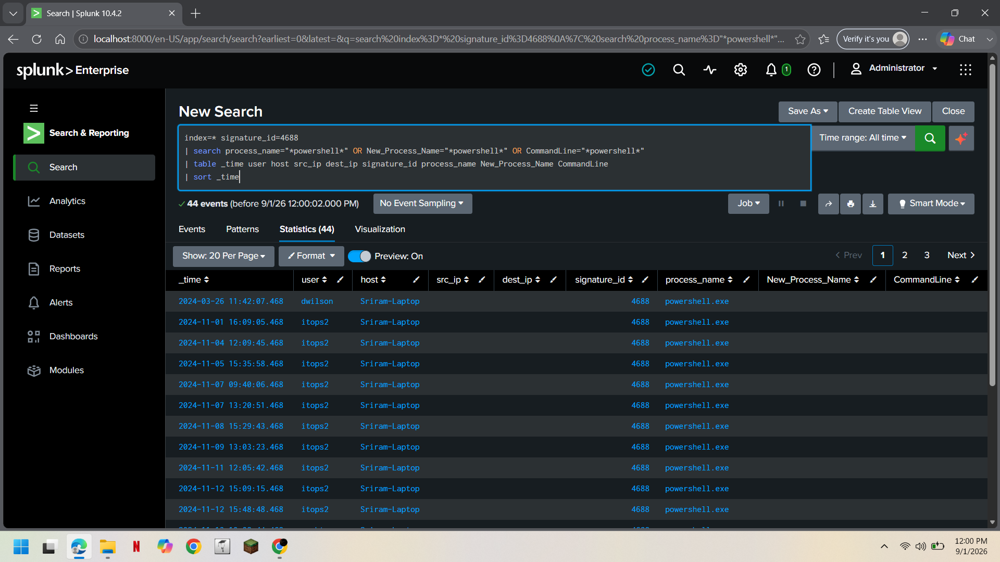
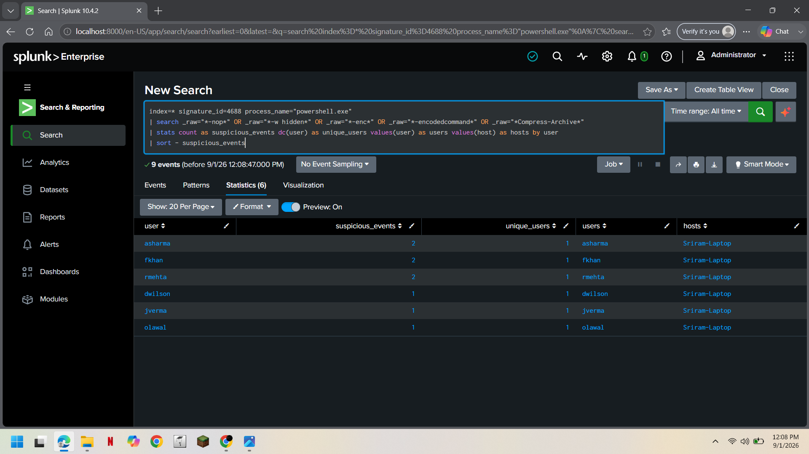
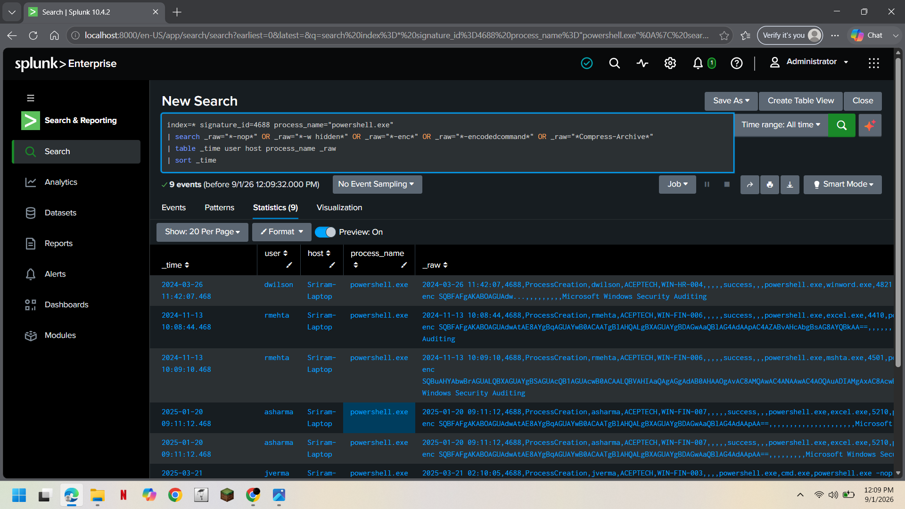
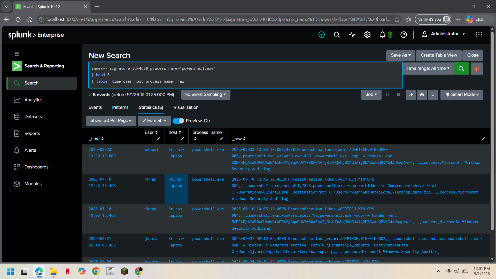
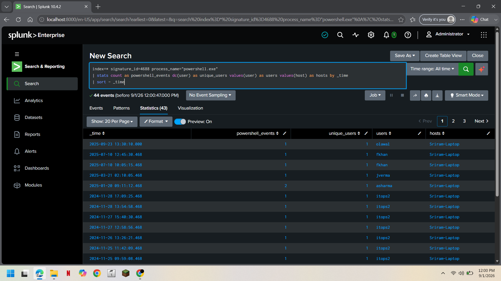
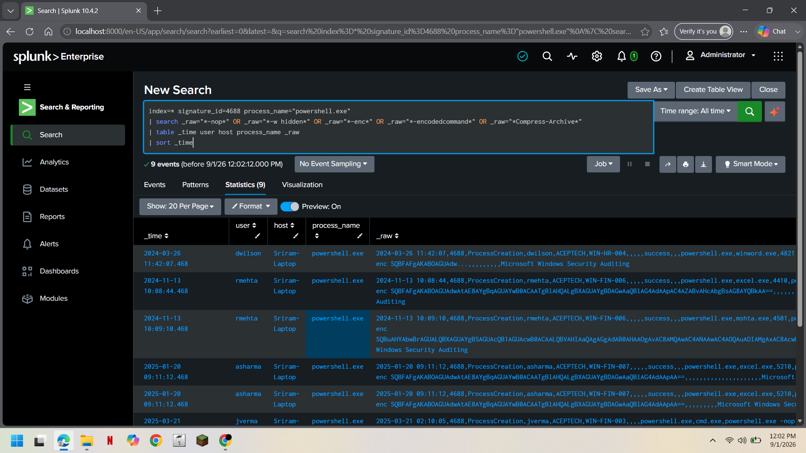
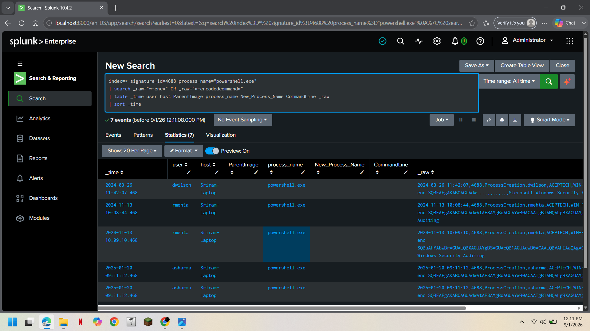

<div align="center">

# 🛡️ Windows Suspicious PowerShell Activity Detection & Investigation

### SOC L1 Security Investigation | Splunk Enterprise | Windows Security Logs

<p>
  
  
  
  
</p>

<p>
A practical SOC L1 investigation focused on detecting and analyzing
potentially suspicious PowerShell activity using Splunk and
Windows Security Event Logs.
</p>

</div>

---

## 📌 Investigation Overview

This project demonstrates a **SOC Level 1 investigation** of
potentially suspicious PowerShell activity.

PowerShell is a legitimate Windows administration and automation
tool. However, attackers can also abuse PowerShell for execution,
obfuscation, payload delivery, persistence, and other malicious
activities.

The investigation focuses on identifying PowerShell process
creation events containing suspicious execution indicators and
then analyzing the associated users, hosts, command-line data,
encoded commands, parent processes, and activity timeline.

### Investigation Flow

**Detection → PowerShell Activity → User Analysis → Suspicious Command Analysis → Encoded PowerShell → Parent Process Analysis → Timeline Analysis → Final Assessment**

---

## 🎯 Investigation Objectives

The investigation was designed to identify:

- PowerShell process creation activity
- Suspicious PowerShell execution parameters
- Encoded PowerShell commands
- Hidden PowerShell execution
- NoProfile PowerShell execution
- Suspicious command-line activity
- Users associated with suspicious PowerShell events
- Parent processes that launched PowerShell
- Repeated PowerShell activity over time

---

## 🧰 Tools & Technologies

| Technology | Purpose |
|---|---|
| **Splunk Enterprise** | SIEM platform used for detection and investigation |
| **Windows Security Logs** | Process creation and security telemetry |
| **SPL** | Searching, filtering and correlating events |
| **Windows Event ID 4688** | Process creation analysis |
| **PowerShell** | Windows scripting and automation technology being investigated |

---

## 🪪 Relevant Windows Event ID

| Event ID | Description | Investigation Purpose |
|:---:|---|---|
| `4688` | New process created | Identify PowerShell process execution |

### Important Fields

| Field | Purpose |
|---|---|
| `_time` | Time of process creation |
| `user` | Account associated with the event |
| `host` | Host where the process executed |
| `process_name` | Process that was created |
| `ParentImage` | Parent process that launched PowerShell |
| `New_Process_Name` | Newly created process |
| `CommandLine` | Command used to launch the process |
| `_raw` | Original event data |

---

# 🔍 Detection

## Detection Logic

The detection focuses on **PowerShell process creation events**
containing command-line indicators that may warrant further
investigation.

The following indicators were investigated:

| Indicator | Why It Matters |
|---|---|
| `-nop` | Runs PowerShell without loading the user profile |
| `-w hidden` | Attempts to hide the PowerShell window |
| `-enc` | Indicates encoded command execution |
| `-encodedcommand` | Executes an encoded PowerShell command |
| `Compress-Archive` | Can be legitimate but may require investigation when combined with suspicious activity |

These indicators are **not automatically malicious**. They are
signals that require contextual investigation.

### Detection Pattern

**PowerShell Process → Suspicious Parameter → Analyst Investigation**

### SPL Detection Query

The detection query is stored separately in:

`detection.spl`

The query identifies PowerShell process creation events
containing the suspicious indicators listed above.

---

## Detection Result

The initial detection identified **9 suspicious PowerShell events**
matching the investigated indicators.

The events involved multiple users and were associated primarily
with the host:

**`Sriram-Laptop`**

### Initial Finding

| Indicator | Finding |
|---|---|
| **Event ID** | `4688` |
| **Process** | `powershell.exe` |
| **Suspicious Events** | **9** |
| **Primary Host Observed** | `Sriram-Laptop` |
| **Assessment** | Potentially Suspicious PowerShell Activity |

<p align="center">
  
  <br>
  <sub><b>Figure 1.</b> Splunk detection identifying potentially suspicious PowerShell process creation activity.</sub>
</p>

---

# 🕵️ Investigation

## 1. PowerShell Activity Overview

The initial investigation reviewed PowerShell process creation
events to determine the overall volume of PowerShell activity.

The analysis identified **44 PowerShell process creation events**
in the available dataset.

This provided the baseline for distinguishing normal PowerShell
activity from executions containing suspicious indicators.

<p align="center">
  
  <br>
  <sub><b>Figure 2.</b> Summary of PowerShell process creation activity across users and hosts.</sub>
</p>

---

## 2. Suspicious User Analysis

The suspicious PowerShell events were grouped by user to determine
which accounts were associated with the activity.

### Finding

The investigation identified **6 users** associated with the
9 suspicious PowerShell events.

| User | Suspicious Events |
|---|---:|
| `asharma` | 2 |
| `fkhan` | 2 |
| `rmehta` | 2 |
| `dwilson` | 1 |
| `jverma` | 1 |
| `olawal` | 1 |

This analysis helps the SOC analyst determine whether the activity
is isolated to a single account or distributed across multiple
accounts.

<p align="center">
  
  <br>
  <sub><b>Figure 3.</b> Users associated with suspicious PowerShell execution.</sub>
</p>

---

## 3. Suspicious PowerShell Event Analysis

The suspicious events were reviewed using the original event
data to identify the actual PowerShell execution parameters.

The investigation focused on indicators including:

- `-nop`
- `-w hidden`
- `-enc`
- `-encodedcommand`
- `Compress-Archive`

### Finding

Multiple suspicious PowerShell execution patterns were identified
within the process creation events.

Reviewing the raw event data provides additional context that
may not be available through parsed fields alone.

<p align="center">
  
  <br>
  <sub><b>Figure 4.</b> Raw Windows process creation events containing suspicious PowerShell indicators.</sub>
</p>

---

## 4. Encoded PowerShell Analysis

Encoded PowerShell commands were investigated separately.

Attackers may use encoded commands to make the contents of a
PowerShell command less obvious during initial inspection.

The presence of encoded PowerShell should therefore be treated
as an investigation signal rather than automatic proof of
malicious activity.

### Finding

The investigation identified **7 PowerShell events containing
encoded command indicators**.

<p align="center">
  
  <br>
  <sub><b>Figure 5.</b> Encoded PowerShell activity identified during investigation.</sub>
</p>

---

## 5. Encoded PowerShell Command Review

The encoded PowerShell events were reviewed in greater detail
to understand the associated users, hosts and process information.

The investigation examined:

- Timestamp
- User
- Host
- Process name
- Encoded execution indicators
- Raw process creation data

### Finding

Encoded PowerShell execution was confirmed in the available
Windows process creation telemetry.

Because encoded commands can conceal their actual contents,
further analysis would normally include decoding the command
when the required telemetry is available and doing so is
appropriate to the investigation.

<p align="center">
  
  <br>
  <sub><b>Figure 6.</b> Detailed investigation of encoded PowerShell execution.</sub>
</p>

---

## 6. Parent Process Analysis

The parent process was investigated to determine what process
initiated PowerShell.

Parent-child process relationships can provide valuable context
when investigating suspicious PowerShell activity.

For example, PowerShell launched by an unusual Office application,
script host, or other unexpected process may require additional
investigation.

### Finding

Parent process information was reviewed for the suspicious
PowerShell executions.

The available parsed fields were correlated with the original
event data to determine the execution context.

<p align="center">
  
  <br>
  <sub><b>Figure 7.</b> Parent process analysis for suspicious PowerShell execution.</sub>
</p>

---

## 7. Timeline Analysis

The suspicious PowerShell events were analyzed chronologically
to identify repeated execution patterns.

Timeline analysis helps determine whether activity occurred as:

- A single isolated event
- Multiple events close together
- Repeated execution over time
- A sequence involving multiple users or hosts

<p align="center">
  
  <br>
  <sub><b>Figure 8.</b> Timeline analysis of suspicious PowerShell activity.</sub>
</p>

---

## 8. Encoded PowerShell Parent Process Analysis

The encoded PowerShell activity was further reviewed together
with parent process information.

This correlation helps the analyst determine how encoded PowerShell
execution was initiated and whether an unusual parent process
was involved.

<p align="center">
  
  <br>
  <sub><b>Figure 9.</b> Encoded PowerShell and parent process investigation.</sub>
</p>

---

# 📊 Investigation Summary

| Investigation Area | Result |
|---|---|
| **PowerShell Process Creation Events** | **44** |
| **Suspicious PowerShell Events** | **9** |
| **Users Associated With Suspicious Events** | **6** |
| **Encoded PowerShell Events** | **7** |
| **Primary Host Observed** | `Sriram-Laptop` |
| **Windows Event ID** | `4688` |
| **Suspicious Indicators** | `-nop`, `-w hidden`, `-enc`, `-encodedcommand`, `Compress-Archive` |
| **Investigation Type** | Suspicious PowerShell Activity |
| **Initial Assessment** | Requires Further Investigation |

---

# ⚠️ Investigation Conclusion

The investigation identified potentially suspicious PowerShell
activity within Windows process creation events.

The main observations were:

1. **44 PowerShell process creation events** were identified.
2. **9 events** matched the suspicious PowerShell indicators.
3. The suspicious activity involved **6 users**.
4. **7 encoded PowerShell events** were identified.
5. The investigation reviewed parent process information.
6. Timeline analysis was performed to understand the activity pattern.
7. The primary host observed during the investigation was
   `Sriram-Laptop`.

### Final Assessment

> **Potentially Suspicious PowerShell Activity — Further Investigation Required**

The available telemetry identifies suspicious execution
characteristics but does not, by itself, establish confirmed
malicious activity or account compromise.

Additional investigation should correlate the PowerShell activity
with endpoint telemetry, user behavior, process ancestry,
network connections, file activity, and other security events.

---

# 🛡️ Recommended SOC L1 Actions

### Immediate Investigation

- [ ] Validate whether the PowerShell execution was authorized.
- [ ] Review the affected user accounts.
- [ ] Review the affected host.
- [ ] Examine the parent process of suspicious PowerShell events.
- [ ] Investigate encoded PowerShell commands where telemetry permits.
- [ ] Review activity immediately before and after the suspicious events.
- [ ] Search for related process creation events.

### Additional Correlation

- [ ] Check network connections associated with the host.
- [ ] Look for suspicious file creation or modification.
- [ ] Check for persistence mechanisms.
- [ ] Review authentication activity around the event time.
- [ ] Search for the same indicators across other endpoints.

### Escalation

- [ ] Escalate to **SOC L2** if malicious execution is confirmed.
- [ ] Escalate if suspicious PowerShell activity is associated with
      credential access, persistence, lateral movement or malware.
- [ ] Follow organizational incident-response procedures if compromise
      indicators are identified.

---

# 🧠 SOC L1 Skills Demonstrated

This investigation demonstrates practical experience with:

- **Splunk SIEM investigation**
- **SPL query development**
- **Windows Security Event ID 4688 analysis**
- **PowerShell activity detection**
- **Process creation analysis**
- **Encoded command investigation**
- **Parent-child process analysis**
- **User and host analysis**
- **Timeline analysis**
- **Security event correlation**
- **SOC L1 alert triage**
- **Incident assessment**
- **Escalation decision-making**

---

# 🖼️ Investigation Evidence

The investigation is supported by nine Splunk screenshots:

| # | Evidence |
|:---:|---|
| **01** | PowerShell detection |
| **02** | Suspicious users |
| **03** | Parent process analysis |
| **04** | Encoded PowerShell |
| **05** | Timeline analysis |
| **06** | Suspicious PowerShell events |
| **07** | Encoded PowerShell events |
| **08** | PowerShell activity summary |
| **09** | Encoded PowerShell parent process analysis |

All screenshots are stored in the `screenshots` directory.

---

# 📁 Project Structure

```text
powershell/
│
├── README.md
├── detection.spl
├── investigation.spl
│
└── screenshots/
    ├── 01_powershell_detection.png
    ├── 02_suspicious_users.png
    ├── 03_parent_process_analysis.png
    ├── 04_encoded_powershell.png
    ├── 05_timeline_analysis.png
    ├── 06_suspicious_powershell_events.png
    ├── 07_encoded_powershell_events.png
    ├── 08_powershell_activity_summary.png
    └── 09_encoded_powershell_parent_process.png
