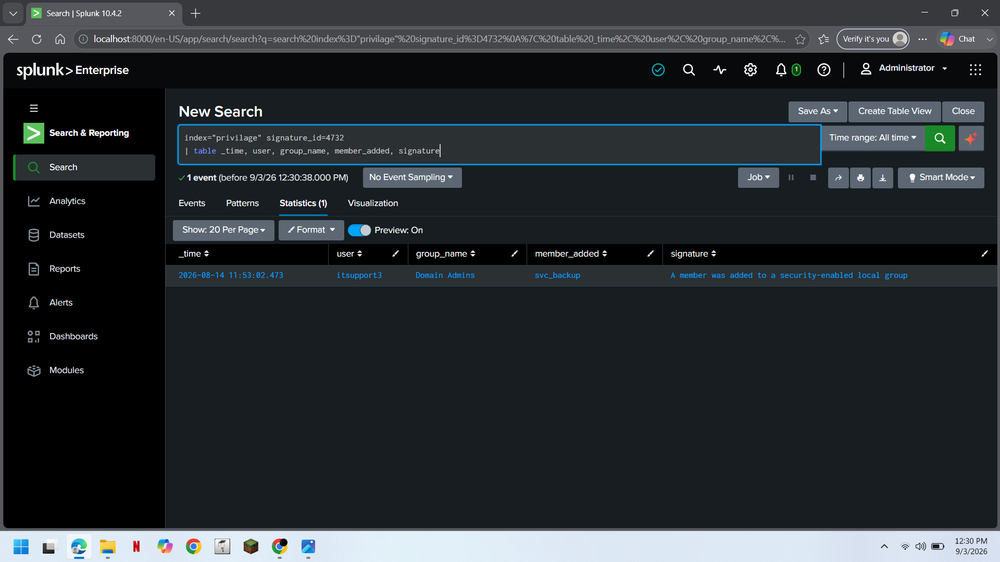
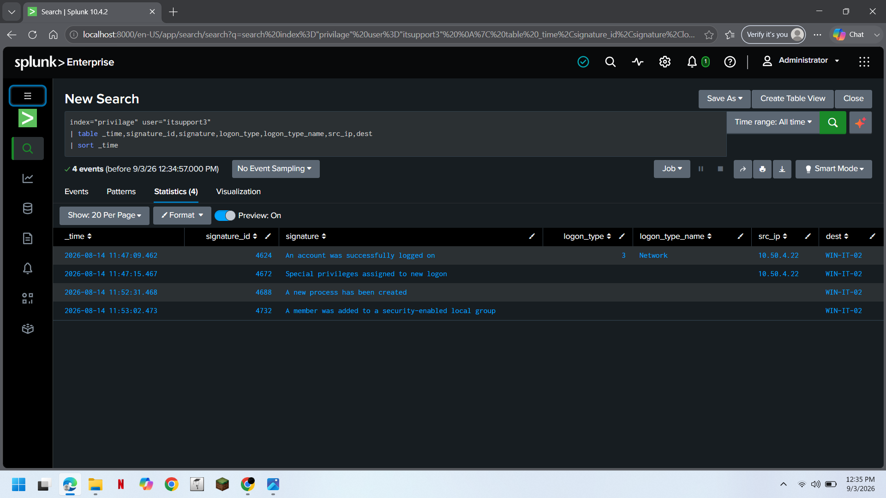
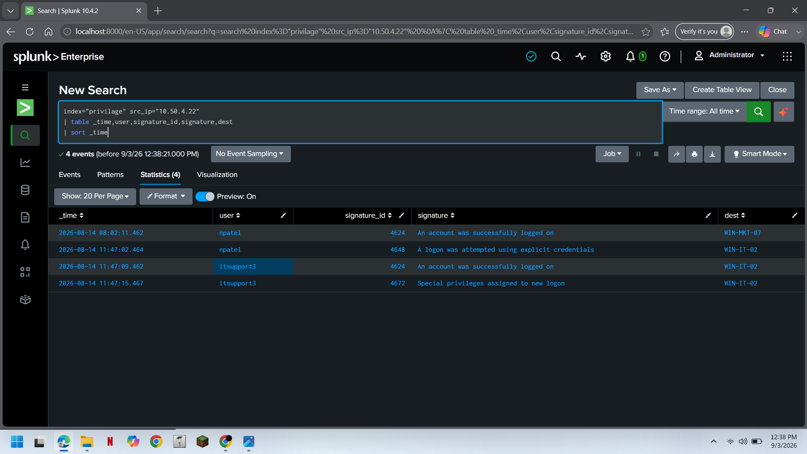
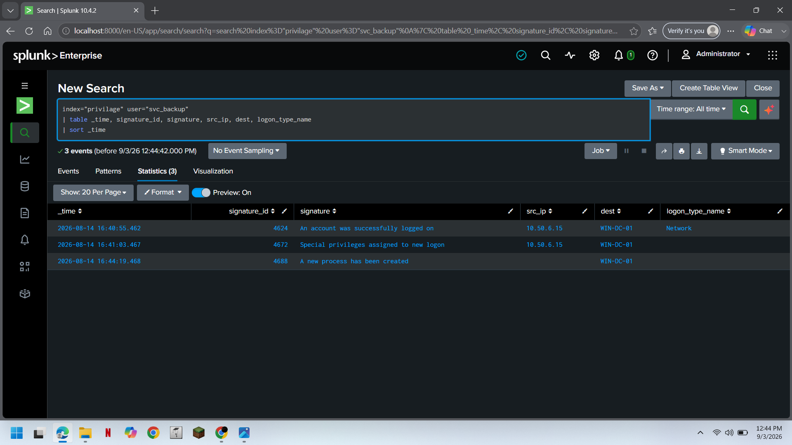
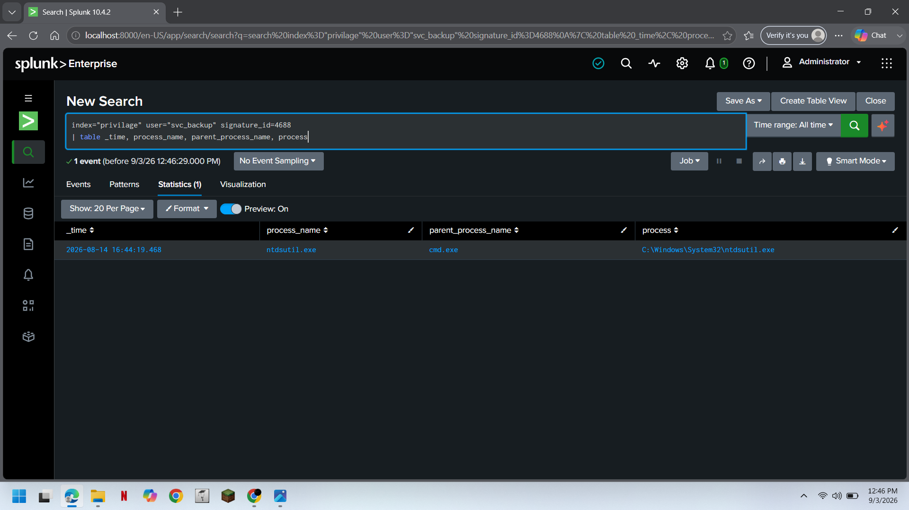

## 05. Evidence — Privilege Escalation Detection

The Splunk search identified a privileged group membership modification involving `svc_backup`.

**Figure 1 — Windows Event ID 4732 showing `svc_backup` being added to the Domain Admins group.**

---

## 06. `itsupport3` Timeline Investigation

After identifying the privileged group modification, the investigation pivoted to the initiating user:

`itsupport3`

### Result

The search returned:

**4 events**

The observed activity included:

| Event ID | Activity |
|:---:|---|
| `4624` | Successful Logon |
| `4672` | Special Privileges Assigned |
| `4688` | Process Creation |
| `4732` | Member Added to Security-Enabled Group |

**Figure 2 — Timeline showing authentication, special privilege assignment, process creation, and privileged group modification.**

---

## 07. Source IP Analysis

The investigation was further expanded by pivoting on the source IP:

`10.50.4.22`

### Result

The search returned:

**4 events**

**Figure 3 — Source IP pivot showing related authentication and privilege activity from `10.50.4.22`.**

---

## 08. Privileged Account Investigation

The investigation then pivoted to the account:

`svc_backup`

### Result

The search returned:

**3 events**

| Event ID | Activity | Destination |
|:---:|---|---|
| `4624` | Successful Logon | `WIN-DC-01` |
| `4672` | Special Privileges Assigned | `WIN-DC-01` |
| `4688` | Process Creation | `WIN-DC-01` |

**Figure 4 — Subsequent activity performed by `svc_backup` after the privileged group modification.**

---

## 09. Process Investigation — `ntdsutil.exe`

The process creation event associated with `svc_backup` was investigated further.

### Result

The search returned:

**1 event**

| Attribute | Value |
|---|---|
| **Process** | `ntdsutil.exe` |
| **Parent Process** | `cmd.exe` |
| **Path** | `C:\Windows\System32\ntdsutil.exe` |
| **Host** | `WIN-DC-01` |

**Figure 5 — Process creation showing `ntdsutil.exe` launched through `cmd.exe` on `WIN-DC-01`.**
